# Vigenère Cracker

Breaks the Vigenère cipher **without knowing the key**, for **English, Russian and
Ukrainian**. It combines four attacks — GPU/CPU brute force, classical frequency
analysis, a dictionary attack and hill climbing — and picks the strategy itself
based on how much ciphertext you have.

The interface is localised into English, Russian and Ukrainian.

| | |
|---|---|
| **Short texts** (20–30 letters) | brute force over the whole key space, GPU-accelerated |
| **Long texts** | the key is *computed* from the text, not guessed. A 25-letter key on a 400-letter text is recovered in seconds |
| **Accuracy** | governed by **N/L**, the letters per key position. On a held-out news corpus with random keys, 100 trials per cell: at least 90 % for every configuration with N/L ≥ 6.7, at least 50 % at N/L ≥ 5, near zero below 3. See [Measured results](#measured-results) and [Validity](#validity-and-known-limitations) |
| **Throughput** | 195 M keys/s on an RTX 4090, 37 M keys/s on a 32-thread CPU — 5.3× the whole CPU pool |
| **Requirements** | Python 3.9+ and numpy. CUDA is optional, everything works on the CPU |

---

## Table of contents

- [Install](#install)
- [Language data](#language-data)
- [Usage](#usage)
- [How it works](#how-it-works)
- [Measured results](#measured-results)
- [Validity and limitations](#validity-and-known-limitations)
- [Hardware notes](#hardware-notes)
- [Project layout](#project-layout)
- [Development](#development)
- [License](#license)

---

## Install

### The easy way

```bash
git clone https://github.com/RE22GDV/vigenere-cracker.git
cd vigenere-cracker
```

Windows — double-click `install.bat`, or:

```bat
install.bat
```

Linux / macOS:

```bash
chmod +x install.sh && ./install.sh
```

The script creates a virtual environment, installs the dependencies, optionally
adds CUDA support and offers to download the language data.

### Manual

```bash
python -m pip install -r requirements.txt
python -m vigenere.download_data
```

Optional CUDA back-end (5.3× faster brute force than the full CPU pool; pick the build that
matches your driver from [pytorch.org](https://pytorch.org/get-started/locally/)):

```bash
python -m pip install torch --index-url https://download.pytorch.org/whl/cu121
```

Or install the package itself:

```bash
python -m pip install .
vigenere-gui
```

---

## Language data

The statistical model needs real text. Word lists and corpora are downloaded
separately because they are far too large for a git repository:

```bash
python -m vigenere.download_data          # all three languages, ~280 MB
python -m vigenere.download_data ru uk    # only the ones you need
```

| Language | Word forms | Corpus | Sources |
|---|---|---|---|
| English | 389 846 | 2 035 404 sentences (82 MB) | dwyl/english-words, Tatoeba |
| Russian | 1 525 368 | 1 217 658 sentences (73 MB) | danakt/russian-words, Tatoeba |
| Ukrainian | 3 352 830 | 188 738 sentences (9.5 MB) | LibreOffice + dict_uk, Tatoeba |

Files land in `data/` (override with the `VIGENERE_DATA` environment variable).
The program runs without them using a small built-in sample, but accuracy on
short texts drops sharply — see [Why the dictionary matters](#why-the-dictionary-matters).

**Ukrainian needs an extra step.** Hunspell ships stems, not word forms, so
`закопано`, `старим` and `дубом` were missing and real sentences lost to
gibberish. The downloader parses the affix file (`uk_UA.aff`, 5715 suffix rules)
and generates the inflected forms itself, taking the list from 350 k entries to
3.35 M.

---

## Usage

### Graphical interface

```bash
python -m vigenere.gui
```

or `run_gui.bat` / `./run_gui.sh`.

- pick the interface language and the plaintext language independently;
- paste the ciphertext — the letter counter and the strategy hint update live;
- press **Start**; candidates stream in while the search runs, the best three
  are highlighted;
- double-click a row to copy the decryption, or type a key by hand to test it;
- export everything to CSV.

### Command line

```bash
# auto strategy, English
python -m vigenere.cli "empo qv sb xdheaoso fp lpp wvzvop" --lang en

# Russian, GPU brute force over short keys
python -m vigenere.cli "члзыт чгдй н пйкымг" --lang ru --mode brute --max-len 5 --gpu

# Ukrainian long text, frequency analysis only
python -m vigenere.cli "..." --lang uk --mode freq --max-len 20

# encrypt something to test with
python -m vigenere.cli --encrypt "meet me at midnight" --key silver --lang en
```

Output:

```
#   Key              Alph.       Score Words  Decryption
--------------------------------------------------------------------------
1   silver           en-26        10.7     5  meet me at midnight by the bridge
2   rdplmeov         en-26       -20.5     6  njad er eg gastoket om wed sheela
```

Key options: `--lang en|ru|uk`, `--ui-lang en|ru|uk`, `--alphabet auto|26|32|33`,
`--mode auto|freq|brute|dict|hill`, `--gpu`, `--procs N`, `--top N`, `--quiet`.

---

## How it works

Full diagrams — pipeline, each attack, scoring, parallelism, module graph — are
in **[docs/ARCHITECTURE.md](docs/ARCHITECTURE.md)**. The short version:

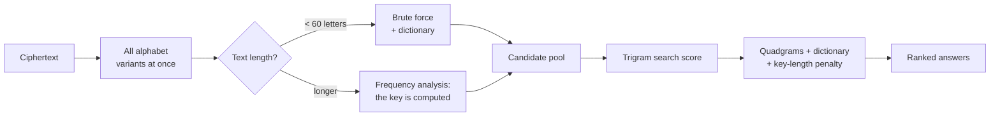

### Alphabet variants

The same plaintext enciphered under a 32-letter and a 33-letter Russian alphabet
produces **different ciphertext**. Choose the wrong one and the correct key is
not in the search space at all, so no amount of searching will find it.

| Language | Variants |
|---|---|
| English | `en-26` |
| Russian | `ru-32` (no Ё), `ru-33` |
| Ukrainian | `uk-33`, `uk-32` (no Ґ) |

The default **Auto** setting tests every variant of the chosen language at once
and reports which one won in the `Alph.` column.

### Attack strategies

**Auto** looks at the ciphertext length and decides:

- **under 60 letters** → brute force + dictionary + frequency analysis;
- **60 letters and up** → frequency analysis + dictionary + a short brute force.

**Frequency analysis** is what makes long texts easy. For a key of length *L* the
text is split into *L* columns; inside a column the cipher is a plain Caesar
shift, so the key letter follows from correlating the column's letter frequencies
with the language.

The **computational cost grows roughly linearly with *L*, not exponentially**: a
25-letter key is recovered in about 11 seconds, where brute force would need
33²⁵ ≈ 10³⁷ trials. Accuracy, however, does *not* become independent of the key
length. What matters is the ratio

$$R = N \,/\, L$$

where *N* is the ciphertext length and *L* the key length — the number of letters
available per key position. When *R* gets small the column statistics thin out
and accuracy degrades regardless of how cheap the search is.

The frequency solution is then refined by **iterated local search**. Plain hill
climbing is not enough: with a 12-letter key on an 80-letter text each column
holds only 6–8 letters, the frequency signal is near noise, and the search
settles one or two letters away from the answer (`cryptogrbphz` instead of
`cryptography`). So the incumbent solution is periodically perturbed and
re-climbed. That single change fixed every failure of this kind.

**Brute force** enumerates the whole key space for a given length. It is exact,
and on a GPU it stays practical up to 7-letter keys.

**Dictionary attack** tries every word in the language, forwards and backwards
(2.9 M candidate keys for Russian) in about two seconds.

**Hill climbing** is a generic fallback for any key length.

### Key-length hints

Two independent estimates are printed to the log: the **index of coincidence**
per column (≈0.055 for Russian and Ukrainian, ≈0.067 for English, whose smaller
alphabet makes coincidences more likely) and the **Kasiski examination**
(distances between repeated n-grams are multiples of the key length). They are
advisory — the program tests the whole range and decides on the final score.
A repeating key is collapsed to its minimal period, so `abcabc` is reported
as `abc`.

### Scoring

Search and final ranking are deliberately different. The search touches billions
of candidates and needs the cheapest usable metric; the final ranking sees a few
thousand and can afford a precise one.

1. **Search** — log-probability under a **trigram** model. The table is M³
   (35 937 numbers for a 33-letter alphabet), small enough to live in cache and
   to be gathered from efficiently on a GPU.
2. **Final** — the same candidates are re-scored with **quadgrams** (M⁴), which
   is far stricter about strings that merely look language-like.
3. **Dictionary coverage** — dynamic programming finds the best split of the
   decryption into real words. Longer words weigh more (L^1.4) and words shorter
   than three letters are ignored, because random letter strings match those
   constantly. Only the top 600 candidates get this step: its cost grows with
   the text length and it would otherwise dominate the run.
4. **Key-length penalty** — ln M ≈ 3.47 per key letter. Without it a long key
   always wins: when the key is as long as the text, *any* plaintext can be
   produced.

Letter frequencies for the frequency analysis are taken **from the model itself**
rather than from a textbook table, so adding a language requires no extra data.

The dictionary weight was first set to 6.0 on eighteen hand-written texts.
A proper selection on a held-out validation split later showed the choice
hardly matters: any weight between 1 and 15 performs identically — see
[Choosing the scoring weights](#choosing-the-scoring-weights).

### Why the dictionary matters

A worked example. `карл у клары украл кораллы` (key `роза`, 33-letter alphabet)
with only the built-in 549-word sample: the search *did* find the right key and
ranked it **943rd out of 1 185 921** — but the model preferred the nonsense
`каже у квщры йдрав дорцелы`. The bottleneck was never the search; it was having
nothing to judge the results with. With the real dictionary the same case is
solved first, by a wide margin.

---

## Measured results

Hardware: **Intel i9-14900K (32 threads) + NVIDIA RTX 4090**, Python 3.12,
numpy 2.1.2.

### How the data is kept honest

The language model and the dictionary are built from **Tatoeba**. Measuring on
Tatoeba sentences would show how well the model memorised its own training
material, so evaluation uses corpora from a different provider and different
genres:

| Split | Source | Genre | Role |
|---|---|---|---|
| train | Tatoeba | conversational | builds the n-gram model and word list |
| validation | Leipzig Wikipedia | encyclopedic | tunes weights, never reported as a result |
| test | Leipzig News 2023 | journalistic | every number below, touched once |

Keys are drawn from four **separate** groups and never pooled into one figure,
because a key that happens to be a dictionary word is found by the dictionary
attack and says nothing about cryptanalysis:

| Group | What it is |
|---|---|
| `dict` | a word from the frequent-word list the program ships |
| `oov` | a real word the program does **not** know: names, rare inflections, taken from the held-out corpus |
| `random` | uniformly random letters |
| `repeat` | a short pattern padded out, tail perturbed |

Unless stated otherwise, results use **random keys** — the hardest group, with
no help from the dictionary.

Reproduce with:

```bash
python benchmarks/studies.py --all --hard --trials 80
```

```bash
python benchmarks/run_benchmarks.py
```

### What actually determines success: N / L

The headline experiment sweeps the full matrix of ciphertext length **N** against
key length **L**, 100 random-key trials per cell, on the held-out news corpus.

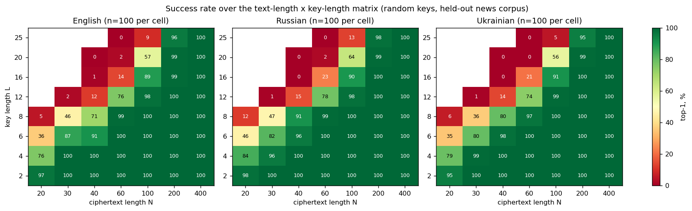

English, success = correct plaintext ranked **first** (`--` = fewer than two
letters per key position, not attempted):

| L \ N | 20 | 30 | 40 | 60 | 100 | 200 | 400 |
|---|---|---|---|---|---|---|---|
| 2 | 97 | 100 | 100 | 100 | 100 | 100 | 100 |
| 4 | 76 | 100 | 100 | 100 | 100 | 100 | 100 |
| 6 | 36 | 87 | 91 | 100 | 100 | 100 | 100 |
| 8 | 5 | 46 | 71 | 99 | 100 | 100 | 100 |
| 12 | — | 2 | 12 | 76 | 98 | 100 | 100 |
| 16 | — | — | 1 | 14 | 89 | 99 | 100 |
| 20 | — | — | 0 | 2 | 57 | 99 | 100 |
| 25 | — | — | — | 0 | 9 | 96 | 100 |

Russian and Ukrainian produce almost the same surface — three different
alphabets, one shape.

All 144 cells collapse onto the single ratio **R = N / L**, the number of
letters available per key position:

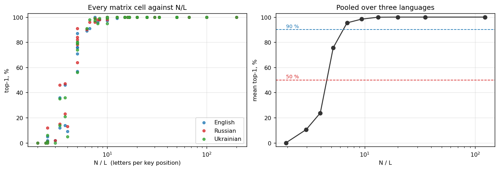

| N / L | cells | mean top-1 | spread |
|---|---|---|---|
| < 2.5 | 6 | 0 % | 0–0 |
| 2.5–3.5 | 18 | 11 % | 0–46 |
| 3.5–4.5 | 9 | 24 % | 5–47 |
| 4.5–6 | 15 | 76 % | 56–91 |
| 6–8 | 12 | 95 % | 89–100 |
| 8–11 | 18 | 98 % | 95–100 |
| ≥ 12.5 | 66 | 100 % | 99–100 |

Thresholds that held for **every** cell, with no exception:

- **N/L ≥ 5** → at least 50 %
- **N/L ≥ 6.7** → at least 90 %
- **N/L ≥ 12.5** → at least 99 %

R is dominant but not the whole story. At exactly R = 5, accuracy falls as the
key gets longer, because more key positions means more independent chances to
get one wrong:

| N=20, L=4 | N=40, L=8 | N=60, L=12 | N=100, L=20 |
|---|---|---|---|
| 76–84 % | 71–91 % | 74–78 % | 56–64 % |

### Dictionary keys versus real keys

Everything below runs at **R = 5** (points 30/6, 40/8, 60/12), where the method
is genuinely under strain. 80 trials per point, 240 per bar, 95 % Wilson
intervals.

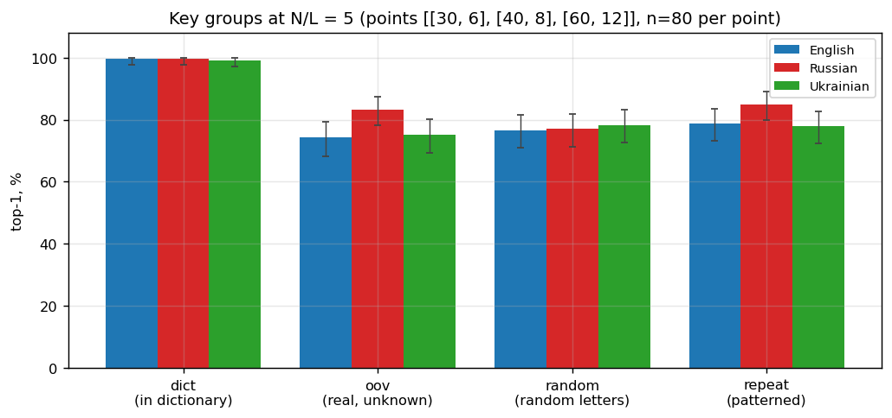

| Group | English | Russian | Ukrainian |
|---|---|---|---|
| `dict` | 100 % [98–100] | 100 % [98–100] | 99 % [97–100] |
| `oov` | 74 % [68–79] | 83 % [78–88] | 75 % [69–80] |
| `random` | 77 % [71–82] | 77 % [71–82] | 78 % [73–83] |
| `repeat` | 79 % [73–83] | 85 % [80–89] | 78 % [72–83] |

A key that is a dictionary word is worth roughly **+22 points**, and that credit
belongs to the dictionary attack, not to the cryptanalysis. The three
non-dictionary groups are statistically indistinguishable from one another.

### Ablation: what each component contributes

Same operating points, 320 trials per row, random keys.

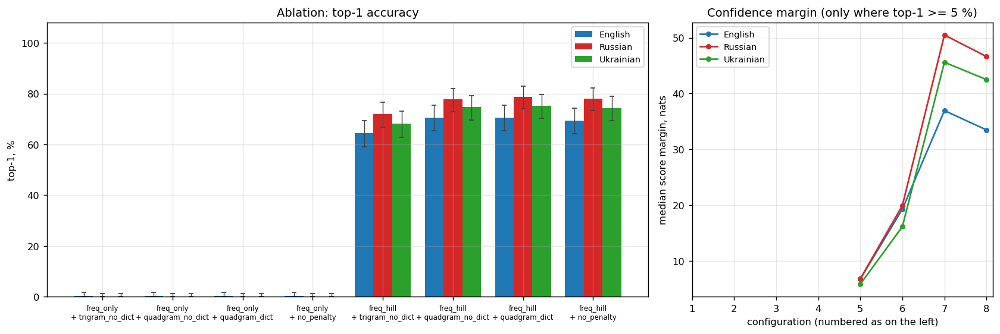

| Search | Scoring | English | Russian | Ukrainian | Margin, nats |
|---|---|---|---|---|---|
| frequency only | any | 0 % | 0 % | 0 % | — |
| + hill climbing | trigrams | 64 % | 72 % | 68 % | 6–7 |
| + hill climbing | quadgrams | 71 % | 78 % | 75 % | 16–20 |
| + hill climbing | quadgrams + dictionary | 71 % | 79 % | 75 % | 37–50 |
| + hill climbing | no key-length penalty | 69 % | 78 % | 74 % | 33–47 |

Three findings, one of them uncomfortable:

1. **Local search is the whole game.** Pure column-by-column frequency analysis
   scores **0 %** here. Everything the tool achieves at this operating point
   comes from the iterated local search on top of it.
2. **Quadgrams earn their place**: +7 points over trigrams, consistently across
   all three languages.
3. **Dictionary coverage adds no accuracy** with random keys — 71 % either way.
   What it does add is confidence: the margin between the winner and the runner
   up roughly **doubles**, from 16–20 to 37–50 nats. It is a tie-breaker and a
   trust signal, not an accuracy mechanism. (It does matter for accuracy on very
   short texts, which is where it was originally tuned.)

The key-length penalty is worth about a point — inside the noise, but it costs
nothing and prevents a failure mode that the matrix cannot show.

### Comparison with baseline methods

Same points, 200 trials, random keys.

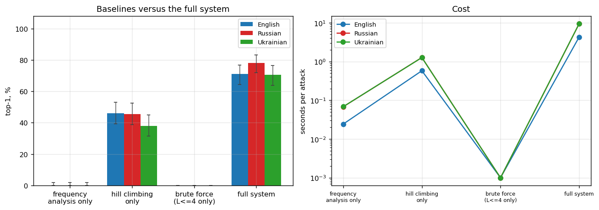

| Method | English | Russian | Ukrainian | Cost |
|---|---|---|---|---|
| index of coincidence + χ² per column | 0 % | 0 % | 0 % | 0.02 s |
| hill climbing from random starts | 46 % | 46 % | 38 % | 1.2 s |
| exhaustive search | not applicable | | | 32⁶ keys and up |
| **full system** | **71 %** | **78 %** | **70 %** | 4.3 s |

The textbook method is not a weak competitor here, it is a non-starter: at five
letters per column its frequency estimate is noise. Random-restart hill climbing
recovers about 43 %, and seeding it from the frequency ranking plus iterated
perturbation takes it to 73 %. Exhaustive search is not merely slow at these key
lengths, it is undefined — 32⁶ is a billion keys and 32²⁰ is beyond counting.

For contrast, at an easy operating point (120 letters, 6-letter key, N/L = 20)
the same baseline reaches **87 %** and every other method reaches 100 %. Which
method looks good depends entirely on where you measure.

### Identifying the key length

The two classical detectors are reported in the log as hints. Measured against
the truth, 40 trials per key length:

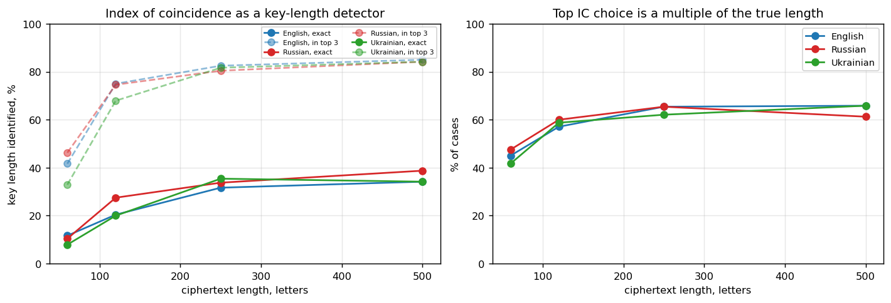

| Language, N | IC exact | IC in top 3 | Kasiski exact | IC picked a **multiple** |
|---|---|---|---|---|
| en, 60 | 12 % | 42 % | 5 % | 45 % |
| en, 500 | 34 % | 85 % | 33 % | 66 % |
| ru, 500 | 39 % | 84 % | 33 % | 61 % |
| uk, 500 | 34 % | 84 % | 32 % | 66 % |

The index of coincidence names the exact key length only 8–39 % of the time. Far
more often — **42–66 % of cases** — its top choice is a *multiple* of the true
length, which is a property of the statistic rather than a bug: a key repeated
twice produces columns that are just as uniform. This is why the hints are
advisory only and the program tests the whole range instead of trusting them.

### Does it recognise the language, or its training corpus?

The model is built from Tatoeba alone. If it had memorised that corpus rather
than learned the language, accuracy would drop on other sources. 50 trials per
point, random keys, R = 5.

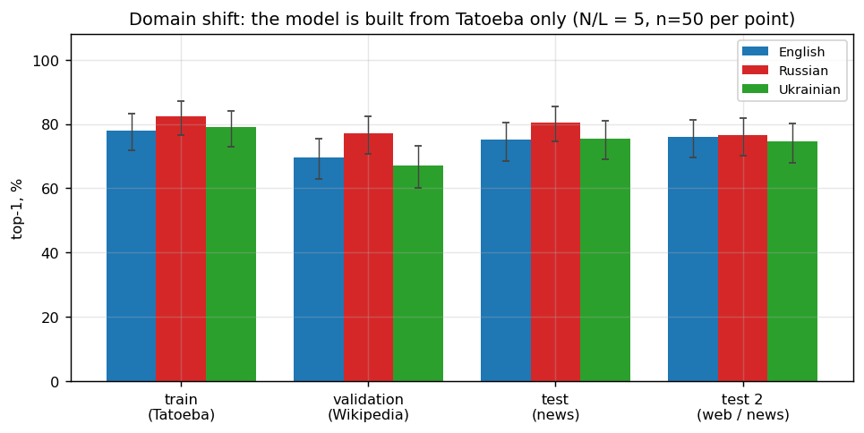

| Split | Genre | English | Russian | Ukrainian |
|---|---|---|---|---|
| train | Tatoeba, conversational | 78 % [72–83] | 82 % [77–87] | 79 % [73–84] |
| validation | Wikipedia, encyclopedic | 70 % [63–75] | 77 % [71–82] | 67 % [60–73] |
| test | news, journalistic | 75 % [69–80] | 80 % [74–85] | 76 % [69–81] |
| test 2 | web / second news slice | 76 % [70–81] | 76 % [70–82] | 74 % [68–80] |

The spread between genres is 3–12 points with overlapping intervals, and news —
never seen during training — is within noise of Tatoeba itself. Wikipedia is
consistently the hardest, which fits: it is dense with proper nouns and technical
terms that the letter model has least support for. There is no sign of the model
having simply memorised its training set.

### Cipher variants

Vigenère, Beaufort and variant Beaufort, on identical texts and keys:

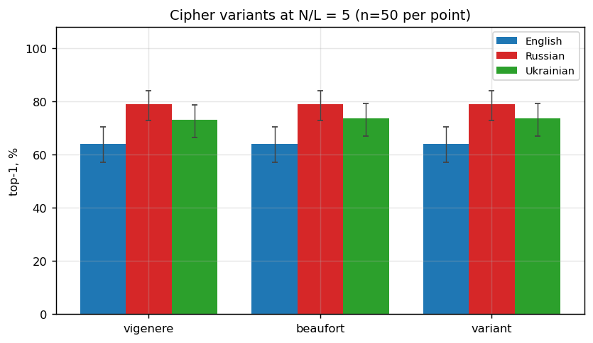

| Variant | English | Russian | Ukrainian |
|---|---|---|---|
| Vigenère | 64 % [57–70] | 79 % [73–84] | 73 % [66–79] |
| Beaufort | 64 % [57–70] | 79 % [73–84] | 74 % [67–79] |
| variant Beaufort | 64 % [57–70] | 79 % [73–84] | 74 % [67–79] |

Identical to within a single trial. That is the expected result — the three
variants are affine relabelings of one another, so the search problem is the
same shape — and it is useful as a regression check that no code path treats
them differently.

### Messy input

Each corruption is applied to the same base texts, R = 5, 50 trials per point:

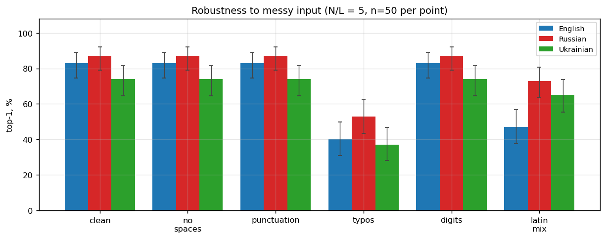

| Input | English | Russian | Ukrainian |
|---|---|---|---|
| clean | 83 % | 87 % | 74 % |
| spaces removed | 83 % | 87 % | 74 % |
| extra punctuation | 83 % | 87 % | 74 % |
| digits inserted | 83 % | 87 % | 74 % |
| **5 % letter typos** | **40 %** | **53 %** | **37 %** |
| **Latin words mixed in** | **47 %** | **73 %** | **65 %** |

The first four rows are identical *by construction*, and that is worth stating
plainly rather than dressing up: only letters are enciphered, so spaces,
punctuation and digits never enter the analysis at all. Removing or adding them
cannot change the result.

The two rows that do matter:

- **Typos are expensive.** Corrupting 5 % of letters roughly halves accuracy.
  Each wrong letter poisons the column it lands in, and at five letters per
  column one bad letter is 20 % of the evidence.
- **Foreign words hurt English most** (83 % → 47 %) because Latin insertions are
  still letters of its alphabet and enter the statistics as noise. In Russian and
  Ukrainian the same insertions fall outside the Cyrillic alphabet and are simply
  skipped, so the text merely gets shorter.

### Choosing the scoring weights

The dictionary weight was originally set to 6.0 on eighteen hand-written texts —
too small a sample to trust. Selected properly on the validation split and then
checked once on test, 40 trials per point over mixed N and L:

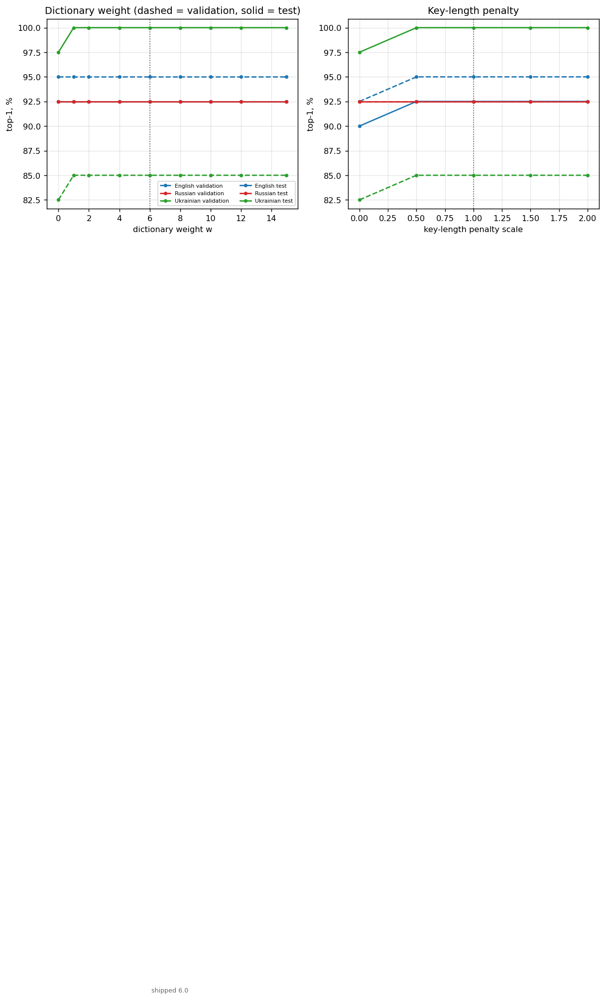

| Dictionary weight w | 0 | 1 | 2 | 4 | 6 | 8 | 10 | 15 |
|---|---|---|---|---|---|---|---|---|
| validation, English | 95 | 95 | 95 | 95 | 95 | 95 | 95 | 95 |
| validation, Ukrainian | 82 | 85 | 85 | 85 | 85 | 85 | 85 | 85 |
| test, English | 92 | 92 | 92 | 92 | 92 | 92 | 92 | 92 |

The curve is **flat**. Any weight from 1 to 15 performs identically; only turning
the term off entirely costs anything, and only for Ukrainian (−3 points). The
shipped 6.0 is therefore not wrong, but it is not tuned either — it sits on a
wide plateau where the exact value is irrelevant. This agrees with the ablation:
dictionary coverage is a confidence mechanism, not an accuracy mechanism.

The key-length penalty behaves differently:

| Penalty scale | 0 | 0.5 | 1.0 | 1.5 | 2.0 |
|---|---|---|---|---|---|
| validation, English | 92 | 95 | 95 | 95 | 95 |
| test, Ukrainian | 98 | 100 | 100 | 100 | 100 |

Switching it off costs 2–3 points; any value at or above 0.5 is equivalent. The
shipped value (scale 1.0, i.e. ln M per key letter) is on that plateau.

### Performance

Measured on the reference machine. Extrapolated figures are labelled as such and
were never actually run to completion.


| Configuration | Keys per second |
|---|---|
| CPU, 1 core | 6.25 M |
| CPU, 8 processes | 22.5 M |
| CPU, 16 processes | 32.7 M |
| CPU, 32 processes | 36.9 M |
| **GPU (RTX 4090)** | **195 M** |

The GPU is **5.3×** faster than the whole 32-thread CPU pool and **31×** faster
than a single core. CPU scaling is strongly sublinear — 32 processes give 5.3×,
not 32× — because the kernel gathers from the trigram table for every candidate
and saturates memory bandwidth long before it saturates the cores.

Start-up costs, measured separately so they are not hidden inside other numbers:

| Step | Time |
|---|---|
| cold process + model from cache | 0.55 s |
| model already in memory | 0.47 s |
| CUDA context creation | 1.03 s |
| spawning an 8-process pool | 0.35 s |

End to end, from ciphertext to ranked answers, in `auto` mode with the GPU
enabled — this is what a user actually waits for:

| Ciphertext | Wall time |
|---|---|
| 30 letters | 1.1 s |
| 100 letters | 2.9 s |
| 200 letters | 4.3 s |
| 400 letters | 7.0 s |

Video memory, and how the batch adapts to it:

| Ciphertext | Batch | Peak VRAM |
|---|---|---|
| 30 letters | 1 048 576 keys | 1244 MB |
| 100 letters | 367 001 keys | 1416 MB |
| 400 letters | 91 750 keys | 1404 MB |

Peak usage stays near 1.4 GB whatever the text length, because the batch size is
computed from the memory actually free. On a card with 1 GB free the batch drops
to 313 174 keys; on anything above 4 GB it saturates at the cap.


| Key length | Keys | GPU | Status |
|---|---|---|---|
| 4 | 1.05 M | 0.03 s | measured |
| 5 | 33.5 M | 0.2 s | measured |
| 6 | 1.07 G | 5.5 s | **measured** |
| 7 | 34.4 G | 197 s | extrapolated |
| 8 | 1.10 T | 6314 s | extrapolated |

Everything up to a 6-letter key was actually enumerated. The 7- and 8-letter rows
are the key count divided by the measured rate; they have not been run.

---

## Validity and known limitations

What the numbers above do and do not support.

### What is controlled for

- **No training data in the results.** The model is built from Tatoeba; every
  reported figure comes from Leipzig news or Wikipedia — a different provider
  and a different genre.
- **Key groups are never pooled.** Dictionary keys are reported apart from real
  keys, so the dictionary attack cannot inflate a cryptanalysis number.
- **Every proportion carries a 95 % Wilson interval.** With 200–320 trials per
  bar the interval is about ±5 points; differences smaller than that are not
  claimed as differences.
- **Operating points are chosen where the method is under strain.** An earlier
  round of these studies ran at 120 letters with a 6-letter key and returned
  100 % for every condition, which measured nothing. Those runs were discarded.

### What is not established

- **One cipher variant carries the matrix.** The N × L matrix is Vigenère only.
  Beaufort and variant Beaufort are measured at a single operating point.
- **Random keys are one distribution.** Real keys chosen by people are neither
  uniform nor dictionary words; the `oov` group approximates this but is drawn
  from news text, so it over-represents proper nouns.
- **Clean text.** Corpora are edited prose. The messy-input study perturbs them
  synthetically, which is not the same as genuinely informal writing.
- **One machine.** All timings come from a single i9-14900K + RTX 4090.
- **The scoring weights are on plateaus, not at optima.** Selection on the
  validation split shows the dictionary weight makes no difference anywhere
  between 1 and 15, and the key-length penalty none above 0.5. The shipped
  values sit on those plateaus, so they are defensible, but "tuned" would
  overstate it — the experiment cannot distinguish them from many alternatives.
- **Ukrainian rests on a thinner corpus** (189 k sentences against 1.2–2.0 M for
  the other two) and on word forms generated from affix rules rather than
  observed in text.

### Statistical caveats

Each matrix cell is 100 trials, so a cell reading 76 % has a 95 % interval of
roughly 67–83 %. The matrix is reliable for its shape and its thresholds, not
for distinguishing 76 % from 80 %.

The N/L thresholds are empirical over the sampled grid, not proven bounds. They
held for all 144 cells of this grid; a different corpus or key distribution could
move them.

### Reproducibility

```bash
python -m vigenere.download_data          # train corpora and dictionaries
python benchmarks/corpora.py              # held-out validation and test corpora
python benchmarks/studies.py --all --hard --trials 80
python benchmarks/run_benchmarks.py
python benchmarks/study_charts.py
```

Seeds are fixed, so the sampling of texts and keys repeats exactly. The full
matrix takes about 6.5 hours; everything else is under an hour.

---

## Hardware notes

Nothing here is tied to a particular GPU.

- **No CUDA?** The GPU option is disabled automatically and everything runs on
  the CPU. `torch` is not required to install or use the program.
- **Small GPU?** Peak video memory is about 1.0–1.3 GB regardless of text
  length, because the batch size is derived from the memory actually available.
  On a CUDA out-of-memory error the batch is halved and the range retried; if
  the GPU fails outright, that key length is silently moved to the CPU.
- **Few cores?** The worker count defaults to `os.cpu_count()`; the process pool
  is created once per run and serves every alphabet and phase.
- **Speed estimates** ("key space ≈ 00:11") are measured on first launch and
  cached in `data/calibration.json`. Progress and ETA during a run always come
  from the observed rate, so they are correct even if the calibration is stale.

Note on `numpy` 2.x with older `torch` builds: the CUDA path never touches the
numpy bridge (tensors are built from Python lists), so a mismatch produces no
errors — the warnings are suppressed.

---

## Project layout

```
vigenere-cracker/
├── vigenere/
│   ├── core.py            alphabets, cipher variants, language model, IC, Kasiski
│   ├── attack.py          engine: brute force, frequency analysis, dictionary, hill climbing
│   ├── langs.py           language definitions and built-in samples
│   ├── i18n.py            interface localisation
│   ├── calibrate.py       machine-specific throughput measurement
│   ├── paths.py           data directory resolution
│   ├── gui.py             Tkinter interface
│   ├── cli.py             command line
│   └── download_data.py   corpora, dictionaries, hunspell affix expansion
├── benchmarks/
│   ├── corpora.py      held-out validation and test corpora
│   ├── harness.py      key groups, attack variants, configurable scoring
│   ├── studies.py      the accuracy studies
│   └── run_benchmarks.py  performance only
├── tests/                 correctness suite
├── docs/                  generated charts
└── data/                  downloaded data (git-ignored)
```

---

## Development

```bash
python tests/test_units.py           # 26 unit tests, a few seconds
python tests/test_correctness.py     # 9 end-to-end cases across 3 languages
pytest tests/                        # both, under pytest
```

`test_units.py` covers the pieces: encrypt/decrypt round trips for every
alphabet and all three cipher variants, the index of coincidence and Kasiski on
known inputs, minimal-period collapsing, CPU and GPU agreeing on the same key
space, and the edge cases — empty text, text with no letters, a key longer than
the text, a one-letter key, punctuation and case, `ё`/`ґ`/`є`/`і`/`ї`, stopping
a run from the interface, and running with no downloaded dictionaries at all.

`test_correctness.py` is the end-to-end suite: it encrypts known phrases in all
three languages, breaks them, and asserts the true plaintext ranks first.

### Adding a language

Add an entry to `LANGUAGES` in `langs.py` (alphabet variants, fold rules, a
single-byte encoding covering the letters, and a small built-in sample), then a
matching entry in `SOURCES` in `download_data.py`. Nothing else is language
specific — the model derives its own letter frequencies.

---

## License

MIT — see [LICENSE](LICENSE).

Language data is downloaded from third-party sources at install time and is not
redistributed here; each source keeps its own license.
