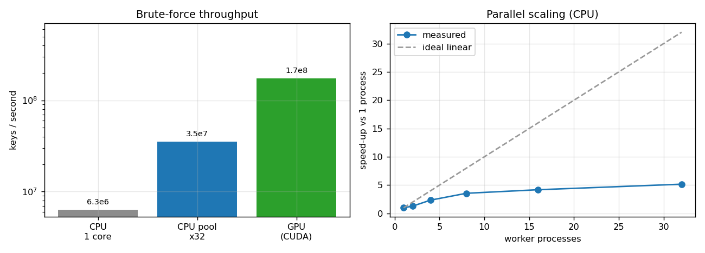
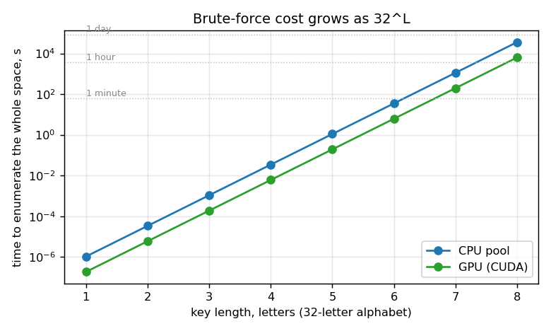
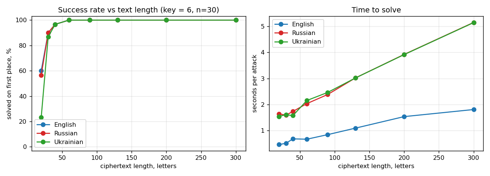
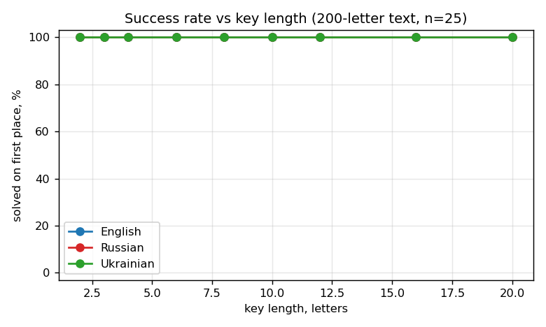
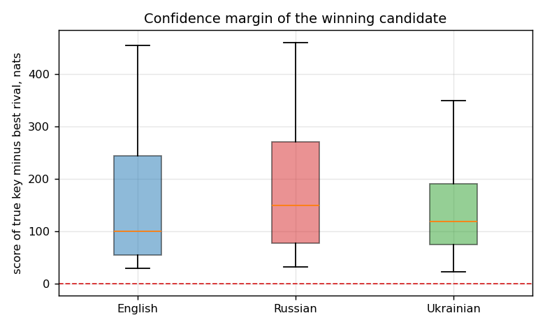

# Vigenère Cracker

Breaks the Vigenère cipher **without knowing the key**, for **English, Russian and
Ukrainian**. It combines four attacks — GPU/CPU brute force, classical frequency
analysis, a dictionary attack and hill climbing — and picks the strategy itself
based on how much ciphertext you have.

The interface is localised into English, Russian and Ukrainian.

| | |
|---|---|
| **Short texts** (20–30 letters) | brute force over the whole key space, GPU-accelerated |
| **Long texts** | the key is *computed* from the text, not guessed — a 25-letter key takes ~11 s |
| **Accuracy** | 100 % on ≥60-letter ciphertexts across all three languages (measured, see below) |
| **Throughput** | 174 M keys/s on an RTX 4090, 35 M keys/s on a 32-thread CPU |
| **Requirements** | Python 3.9+ and numpy. CUDA is optional, everything works on the CPU |

---

## Table of contents

- [Install](#install)
- [Language data](#language-data)
- [Usage](#usage)
- [How it works](#how-it-works)
- [Measured results](#measured-results)
- [Hardware notes](#hardware-notes)
- [Project layout](#project-layout)
- [Development](#development)
- [License](#license)

---

## Install

### The easy way

```bash
git clone https://github.com/<you>/vigenere-cracker.git
cd vigenere-cracker
```

Windows — double-click `install.bat`, or:

```bat
install.bat
```

Linux / macOS:

```bash
chmod +x install.sh && ./install.sh
```

The script creates a virtual environment, installs the dependencies, optionally
adds CUDA support and offers to download the language data.

### Manual

```bash
python -m pip install -r requirements.txt
python -m vigenere.download_data
```

Optional CUDA back-end (roughly 5× faster brute force; pick the build that
matches your driver from [pytorch.org](https://pytorch.org/get-started/locally/)):

```bash
python -m pip install torch --index-url https://download.pytorch.org/whl/cu121
```

Or install the package itself:

```bash
python -m pip install .
vigenere-gui
```

---

## Language data

The statistical model needs real text. Word lists and corpora are downloaded
separately because they are far too large for a git repository:

```bash
python -m vigenere.download_data          # all three languages, ~280 MB
python -m vigenere.download_data ru uk    # only the ones you need
```

| Language | Word forms | Corpus | Sources |
|---|---|---|---|
| English | 389 846 | 2 035 404 sentences (82 MB) | dwyl/english-words, Tatoeba |
| Russian | 1 525 368 | 1 217 658 sentences (73 MB) | danakt/russian-words, Tatoeba |
| Ukrainian | 3 352 830 | 188 738 sentences (9.5 MB) | LibreOffice + dict_uk, Tatoeba |

Files land in `data/` (override with the `VIGENERE_DATA` environment variable).
The program runs without them using a small built-in sample, but accuracy on
short texts drops sharply — see [Why the dictionary matters](#why-the-dictionary-matters).

**Ukrainian needs an extra step.** Hunspell ships stems, not word forms, so
`закопано`, `старим` and `дубом` were missing and real sentences lost to
gibberish. The downloader parses the affix file (`uk_UA.aff`, 5715 suffix rules)
and generates the inflected forms itself, taking the list from 350 k entries to
3.35 M.

---

## Usage

### Graphical interface

```bash
python -m vigenere.gui
```

or `run_gui.bat` / `./run_gui.sh`.

- pick the interface language and the plaintext language independently;
- paste the ciphertext — the letter counter and the strategy hint update live;
- press **Start**; candidates stream in while the search runs, the best three
  are highlighted;
- double-click a row to copy the decryption, or type a key by hand to test it;
- export everything to CSV.

### Command line

```bash
# auto strategy, English
python -m vigenere.cli "empo qv sb xdheaoso fp lpp wvzvop" --lang en

# Russian, GPU brute force over short keys
python -m vigenere.cli "члзыт чгдй н пйкымг" --lang ru --mode brute --max-len 5 --gpu

# Ukrainian long text, frequency analysis only
python -m vigenere.cli "..." --lang uk --mode freq --max-len 20

# encrypt something to test with
python -m vigenere.cli --encrypt "meet me at midnight" --key silver --lang en
```

Output:

```
#   Key              Alph.       Score Words  Decryption
--------------------------------------------------------------------------
1   silver           en-26        10.7     5  meet me at midnight by the bridge
2   rdplmeov         en-26       -20.5     6  njad er eg gastoket om wed sheela
```

Key options: `--lang en|ru|uk`, `--ui-lang en|ru|uk`, `--alphabet auto|26|32|33`,
`--mode auto|freq|brute|dict|hill`, `--gpu`, `--procs N`, `--top N`, `--quiet`.

---

## How it works

### Alphabet variants

The same plaintext enciphered under a 32-letter and a 33-letter Russian alphabet
produces **different ciphertext**. Choose the wrong one and the correct key is
not in the search space at all, so no amount of searching will find it.

| Language | Variants |
|---|---|
| English | `en-26` |
| Russian | `ru-32` (no Ё), `ru-33` |
| Ukrainian | `uk-33`, `uk-32` (no Ґ) |

The default **Auto** setting tests every variant of the chosen language at once
and reports which one won in the `Alph.` column.

### Attack strategies

**Auto** looks at the ciphertext length and decides:

- **under 60 letters** → brute force + dictionary + frequency analysis;
- **60 letters and up** → frequency analysis + dictionary + a short brute force.

**Frequency analysis** is what makes long texts easy. For a key of length *L* the
text is split into *L* columns; inside a column the cipher is a plain Caesar
shift, so the key letter follows from correlating the column's letter frequencies
with the language. The work grows as *L*, not as 32^*L*, so key length stops
mattering — a **25-letter key is recovered in about 11 seconds**, while brute
force would need 33²⁵ ≈ 10³⁷ trials.

The frequency solution is then refined by **iterated local search**. Plain hill
climbing is not enough: with a 12-letter key on an 80-letter text each column
holds only 6–8 letters, the frequency signal is near noise, and the search
settles one or two letters away from the answer (`cryptogrbphz` instead of
`cryptography`). So the incumbent solution is periodically perturbed and
re-climbed. That single change fixed every failure of this kind.

**Brute force** enumerates the whole key space for a given length. It is exact,
and on a GPU it stays practical up to 7-letter keys.

**Dictionary attack** tries every word in the language, forwards and backwards
(2.9 M candidate keys for Russian) in about two seconds.

**Hill climbing** is a generic fallback for any key length.

### Key-length hints

Two independent estimates are printed to the log: the **index of coincidence**
per column (≈0.055 for Russian and Ukrainian, ≈0.067 for English, whose smaller
alphabet makes coincidences more likely) and the **Kasiski examination**
(distances between repeated n-grams are multiples of the key length). They are
advisory — the program tests the whole range and decides on the final score.
A repeating key is collapsed to its minimal period, so `abcabc` is reported
as `abc`.

### Scoring

Search and final ranking are deliberately different. The search touches billions
of candidates and needs the cheapest usable metric; the final ranking sees a few
thousand and can afford a precise one.

1. **Search** — log-probability under a **trigram** model. The table is M³
   (35 937 numbers for a 33-letter alphabet), small enough to live in cache and
   to be gathered from efficiently on a GPU.
2. **Final** — the same candidates are re-scored with **quadgrams** (M⁴), which
   is far stricter about strings that merely look language-like.
3. **Dictionary coverage** — dynamic programming finds the best split of the
   decryption into real words. Longer words weigh more (L^1.4) and words shorter
   than three letters are ignored, because random letter strings match those
   constantly. Only the top 600 candidates get this step: its cost grows with
   the text length and it would otherwise dominate the run.
4. **Key-length penalty** — ln M ≈ 3.47 per key letter. Without it a long key
   always wins: when the key is as long as the text, *any* plaintext can be
   produced.

Letter frequencies for the frequency analysis are taken **from the model itself**
rather than from a textbook table, so adding a language requires no extra data.

The weights were tuned, not guessed: on a set of 18 short texts a stable 18/18
plateau spans a dictionary weight of 5–14 with a minimum word length of 3. The
low end of the plateau (6.0) is used so that letter statistics keep influence on
names and rare words.

### Why the dictionary matters

A worked example. `карл у клары украл кораллы` (key `роза`, 33-letter alphabet)
with only the built-in 549-word sample: the search *did* find the right key and
ranked it **943rd out of 1 185 921** — but the model preferred the nonsense
`каже у квщры йдрав дорцелы`. The bottleneck was never the search; it was having
nothing to judge the results with. With the real dictionary the same case is
solved first, by a wide margin.

---

## Measured results

All numbers below come from `benchmarks/run_benchmarks.py` on an
**Intel i9-14900K (32 threads) + NVIDIA RTX 4090**, Python 3.12, numpy 2.1.2.
Plaintexts are sampled from the downloaded corpora and keys from the word lists,
so these are averages over real material rather than hand-picked examples.

Reproduce with:

```bash
python benchmarks/run_benchmarks.py          # ~21 minutes
python benchmarks/run_benchmarks.py --quick  # fewer trials
```

### Throughput and parallel scaling



| Configuration | Keys per second |
|---|---|
| CPU, 1 core | 6.29 M |
| CPU, 4 processes | 16.0 M |
| CPU, 8 processes | 24.3 M |
| CPU, 32 processes | 35.2 M |
| **GPU (RTX 4090)** | **173.9 M** |

Scaling is clearly sublinear — 32 processes give 5.2×, not 32×. The kernel is
memory-bound: every candidate key gathers from the trigram table, so bandwidth
saturates long before the cores do. This is exactly why the built-in speed
estimate is *measured* rather than extrapolated from one core.

### Brute-force cost



Time to enumerate the entire key space of a 32-letter alphabet:

| Key length | Keys | CPU (32 proc) | GPU |
|---|---|---|---|
| 4 | 1.05 M | 0.03 s | 0.006 s |
| 5 | 33.5 M | 1.1 s | 0.2 s |
| 6 | 1.07 G | 35 s | **6.2 s** |
| 7 | 34.4 G | 19 min | **3.3 min** |
| 8 | 1.10 T | 10 h | 1.8 h |

Practical limit: **7 letters on a GPU, 6 on a CPU**. Beyond that, use frequency
analysis, which does not care about key length at all.

### Success rate vs ciphertext length



Key length fixed at 6, 30 random trials per point, success = correct plaintext
ranked **first**:

| Letters | English | Russian | Ukrainian |
|---|---|---|---|
| 20 | 60 % | 57 % | 23 % |
| 30 | 90 % | 90 % | 87 % |
| 40 | 97 % | 97 % | 97 % |
| 60 | 100 % | 100 % | 100 % |
| 90–300 | 100 % | 100 % | 100 % |

Below ~40 letters the problem becomes genuinely ill-posed rather than merely
hard: with a 6-letter key a 20-letter text leaves 3.3 letters per column, and
several different keys produce equally plausible readings. Ukrainian is the
weakest at 20 letters because it has the largest alphabet and the smallest
corpus of the three.

Time per attack grows linearly with the text, from 0.5 s to about 5 s.

### Success rate vs key length



200-letter texts, 25 trials per point:

| Key length | 2 | 3 | 4 | 6 | 8 | 10 | 12 | 16 | 20 |
|---|---|---|---|---|---|---|---|---|---|
| English | 100 % | 100 % | 100 % | 100 % | 100 % | 100 % | 100 % | 100 % | 100 % |
| Russian | 100 % | 100 % | 100 % | 100 % | 100 % | 100 % | 100 % | 100 % | 100 % |
| Ukrainian | 100 % | 100 % | 100 % | 100 % | 100 % | 100 % | 100 % | 100 % | 100 % |

Given enough text, key length is simply not a difficulty axis for frequency
analysis — which is the whole point of the method.

### How confident is the winner?



The margin between the correct key and the best competing candidate, over
~50 random cases per language (mixed text and key lengths):

| Language | Median margin | Ranked first |
|---|---|---|
| English | 99.1 nats | 100 % |
| Russian | 149.0 nats | 100 % |
| Ukrainian | 117.7 nats | 100 % |

The gap is large, so the top answer is not a coin flip between near-ties: when
the tool is right, it is right by a wide margin.

---

## Hardware notes

Nothing here is tied to a particular GPU.

- **No CUDA?** The GPU option is disabled automatically and everything runs on
  the CPU. `torch` is not required to install or use the program.
- **Small GPU?** Peak video memory is about 1.0–1.3 GB regardless of text
  length, because the batch size is derived from the memory actually available.
  On a CUDA out-of-memory error the batch is halved and the range retried; if
  the GPU fails outright, that key length is silently moved to the CPU.
- **Few cores?** The worker count defaults to `os.cpu_count()`; the process pool
  is created once per run and serves every alphabet and phase.
- **Speed estimates** ("key space ≈ 00:11") are measured on first launch and
  cached in `data/calibration.json`. Progress and ETA during a run always come
  from the observed rate, so they are correct even if the calibration is stale.

Note on `numpy` 2.x with older `torch` builds: the CUDA path never touches the
numpy bridge (tensors are built from Python lists), so a mismatch produces no
errors — the warnings are suppressed.

---

## Project layout

```
vigenere-cracker/
├── vigenere/
│   ├── core.py            alphabets, cipher variants, language model, IC, Kasiski
│   ├── attack.py          engine: brute force, frequency analysis, dictionary, hill climbing
│   ├── langs.py           language definitions and built-in samples
│   ├── i18n.py            interface localisation
│   ├── calibrate.py       machine-specific throughput measurement
│   ├── paths.py           data directory resolution
│   ├── gui.py             Tkinter interface
│   ├── cli.py             command line
│   └── download_data.py   corpora, dictionaries, hunspell affix expansion
├── benchmarks/            measurement suite
├── tests/                 correctness suite
├── docs/                  generated charts
└── data/                  downloaded data (git-ignored)
```

---

## Development

```bash
python tests/test_correctness.py     # 9 cases across 3 languages
pytest tests/                        # same, under pytest
```

The correctness suite encrypts known phrases in all three languages, breaks
them, and asserts the true plaintext ranks first.

### Adding a language

Add an entry to `LANGUAGES` in `langs.py` (alphabet variants, fold rules, a
single-byte encoding covering the letters, and a small built-in sample), then a
matching entry in `SOURCES` in `download_data.py`. Nothing else is language
specific — the model derives its own letter frequencies.

---

## License

MIT — see [LICENSE](LICENSE).

Language data is downloaded from third-party sources at install time and is not
redistributed here; each source keeps its own license.
