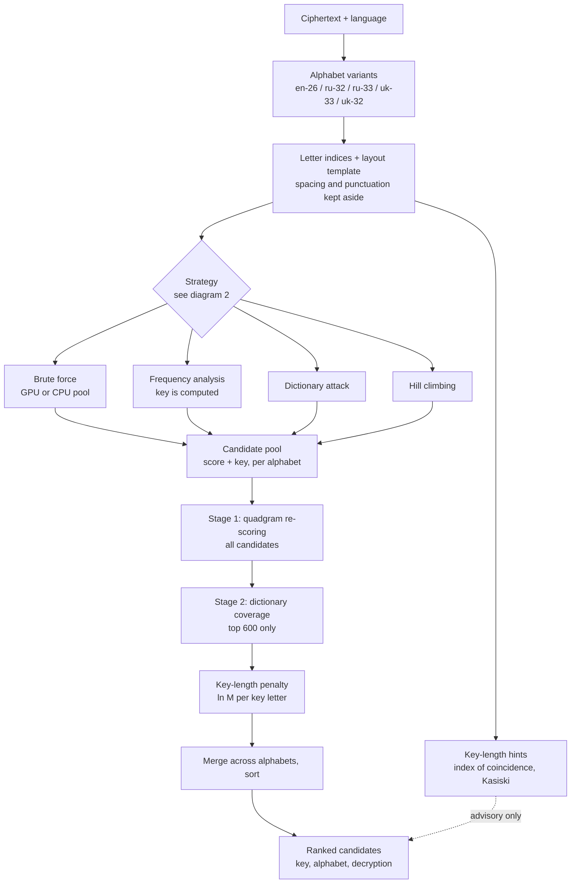
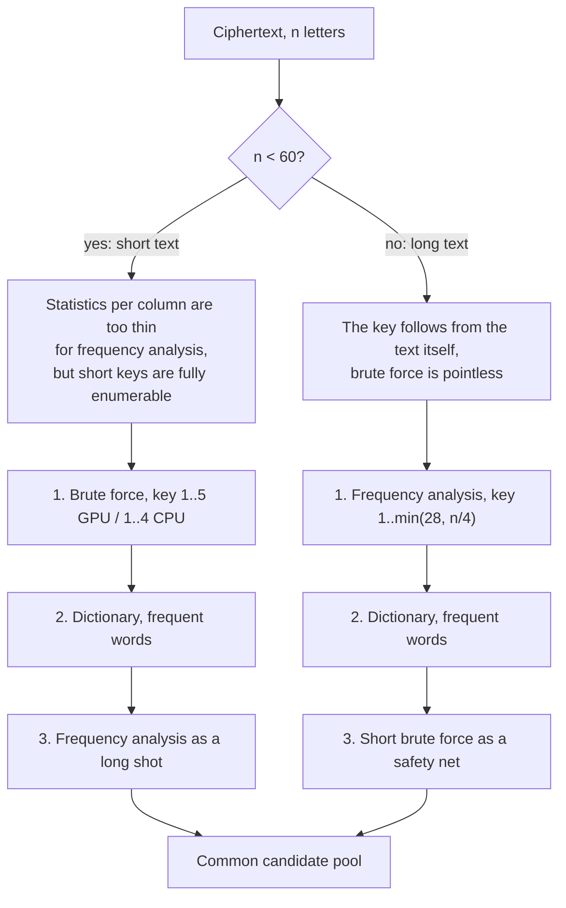
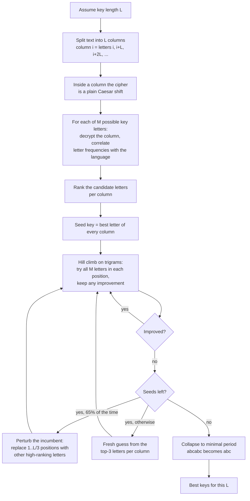
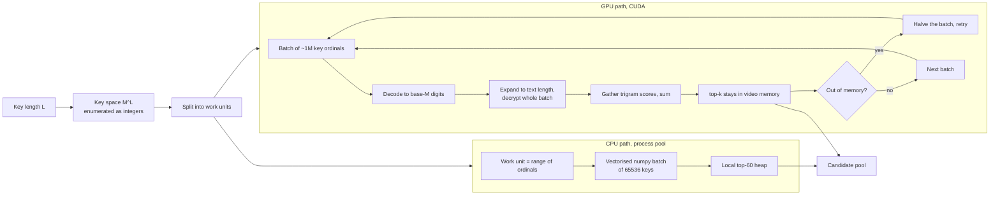
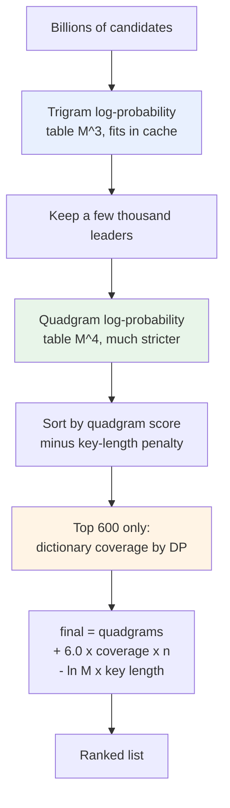
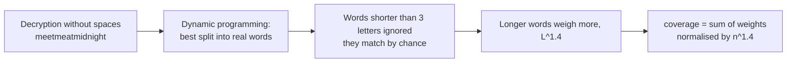
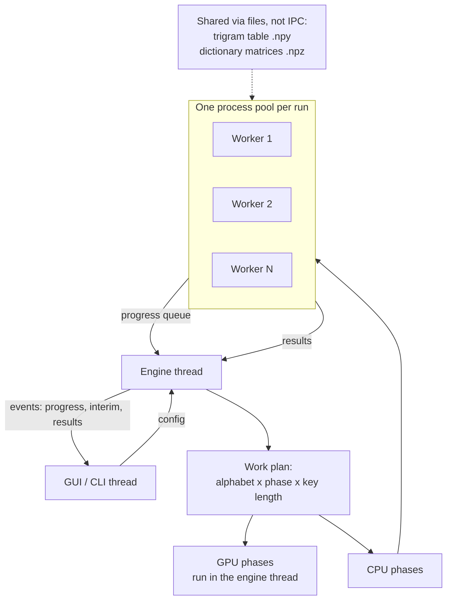
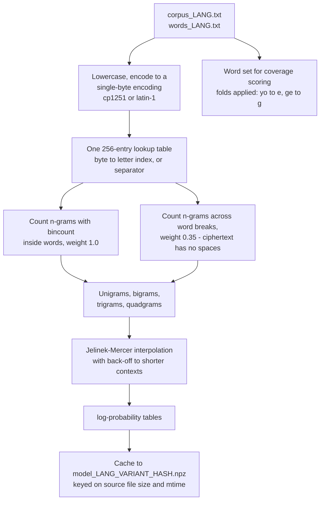
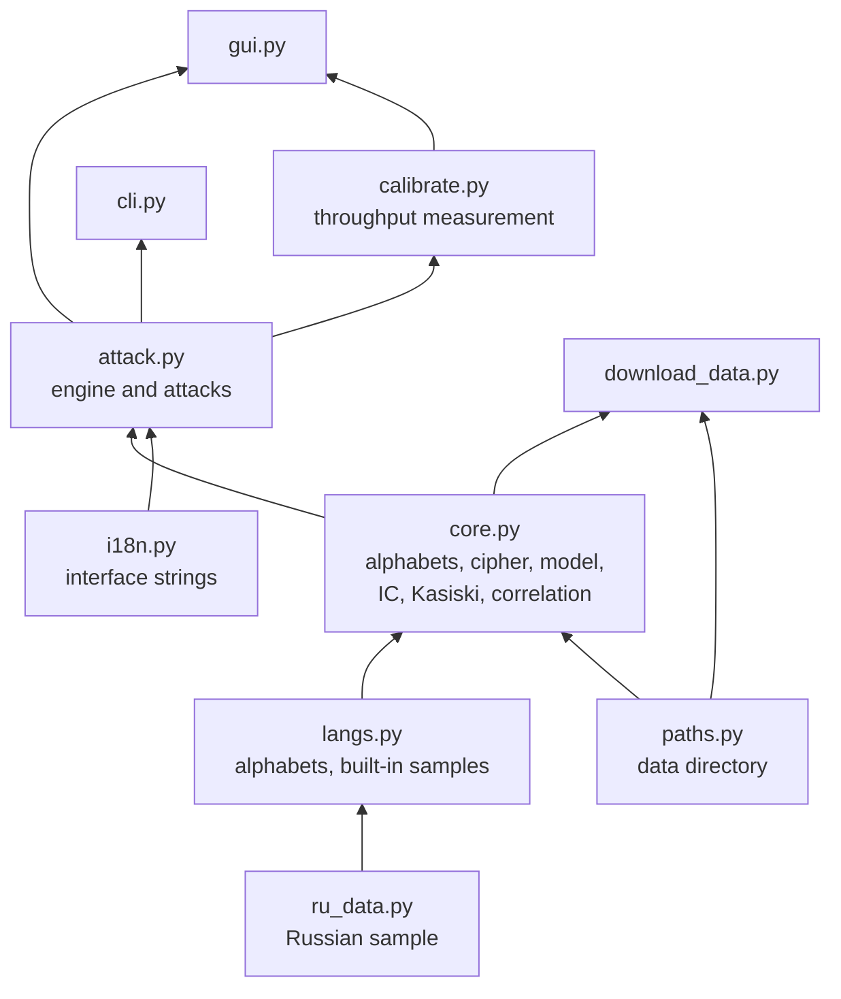

# Architecture

How the program is put together and why. All diagrams render natively on GitHub.

- [1. End-to-end pipeline](#1-end-to-end-pipeline)
- [2. Choosing a strategy](#2-choosing-a-strategy)
- [3. Frequency analysis](#3-frequency-analysis)
- [4. Brute force](#4-brute-force)
- [5. Two-stage scoring](#5-two-stage-scoring)
- [6. Execution and parallelism](#6-execution-and-parallelism)
- [7. Language model construction](#7-language-model-construction)
- [8. Module dependencies](#8-module-dependencies)

---

## 1. End-to-end pipeline

From ciphertext to a ranked list of candidates.

The layout template is what lets the result come back as `find me at the old stone`
rather than `findmeattheoldstone`: only letters are enciphered, everything else is
restored in place.

---

## 2. Choosing a strategy

`Auto` mode does not try everything blindly — the useful method depends on how
much ciphertext there is.

Phases are ordered so the most likely winner runs first: partial results appear
in the table while the rest is still running, and `Stop` at any moment leaves a
usable answer.

---

## 3. Frequency analysis

The method that makes key length irrelevant. Work grows as **L**, not as **32^L**.

**Why the perturbation loop exists.** With a 12-letter key on an 80-letter text
each column holds only 6–8 letters; the frequency signal is close to noise and
plain hill climbing settles one or two letters away from the answer — it produced
`cryptogrbphz` instead of `cryptography`. Diagnosis showed the true key scored
*much* higher (−18 versus −124 nats), so the model was right and the search was
at fault. Iterated local search fixed every case of this kind.

---

## 4. Brute force

Exact, and the only option when there is too little text for statistics.

Keeping the leaders in video memory matters: moving the top of every batch back
into Python cost more than the search itself — 81 s versus 11.6 s for a 6-letter
key.

---

## 5. Two-stage scoring

Search and ranking use deliberately different metrics.

Each term earns its place:

| Term | Why it is there |
|---|---|
| Trigrams | cheap enough for billions of candidates |
| Quadgrams | separates real language from "almost language" |
| Dictionary coverage | decisive on short texts, where letter statistics are thin |
| Key-length penalty | without it the longest key always wins — with a key as long as the text, *any* plaintext is reachable |

Dictionary coverage is limited to 600 leaders because its cost grows with text
length: unrestricted, it took 16 s out of a 25 s run on a 381-letter text.

---

## 6. Execution and parallelism

Three decisions that came out of profiling:

1. **One pool per run**, serving every alphabet and every phase. Starting 32
   processes costs about 4.5 s on Windows and should be paid once, not per
   alphabet.
2. **Heavy tables go through files.** Workers memory-load the trigram table and
   the dictionary matrices themselves; passing them as arguments would move
   megabytes per task.
3. **The dictionary is converted once, in the parent.** Letting each of 32
   workers parse millions of words took longer than the attack itself —
   15 s versus 1.6 s.

---

## 7. Language model construction

The single-byte trick is what makes a 73 MB corpus process in 7.5 s: turning text
into letter indices is one array lookup instead of a per-character Python loop.
Letter frequencies for the frequency analysis are then read back out of this
model, so no language needs a hand-written frequency table.

---

## 8. Module dependencies

`core` knows nothing about attacks, `attack` knows nothing about the interface,
and adding a language touches only `langs.py` and `download_data.py`.
